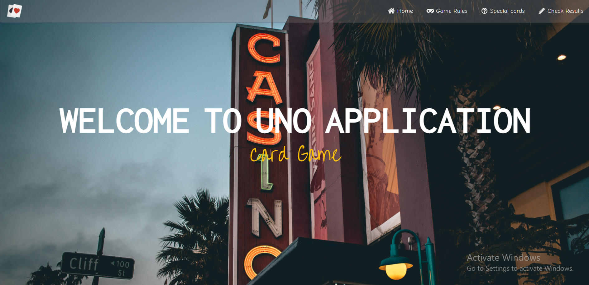

# CV (REACT AND REDUX)

1. Download
2. npm install
3. npm start
4. Open http://localhost:3000 to view it in the browser

# PART OF THE APPLICATION

<ul>
<li>Home page</li>
<li>Game rules</li>
Select the game for which you want to see the rules. 
<li>Special cards</li>
Select the special card for which you want to read the explanation.
<li>Check results</li>
Search for a player
Add player
Delete player
Edit player
<li>Quiz</li>
Here you can find my linkedin and github
</ul>

## Home page

## Game rules page

## Special cards page

## Check results page

## Quiz page

